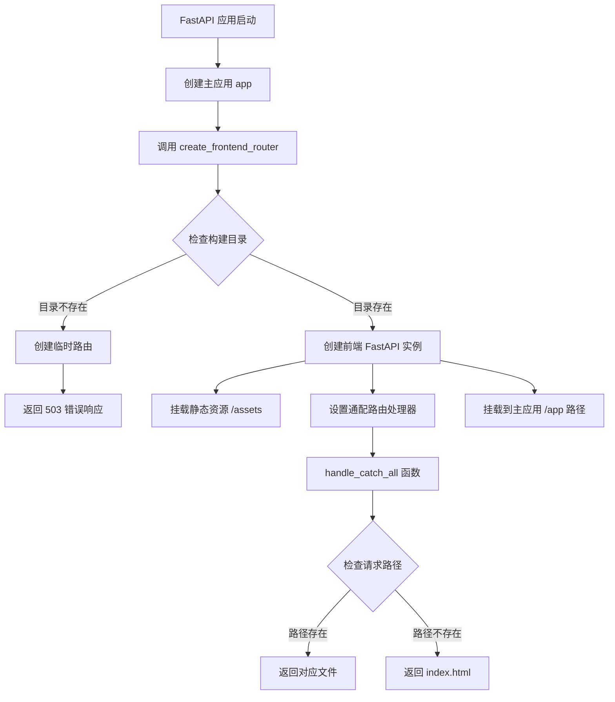
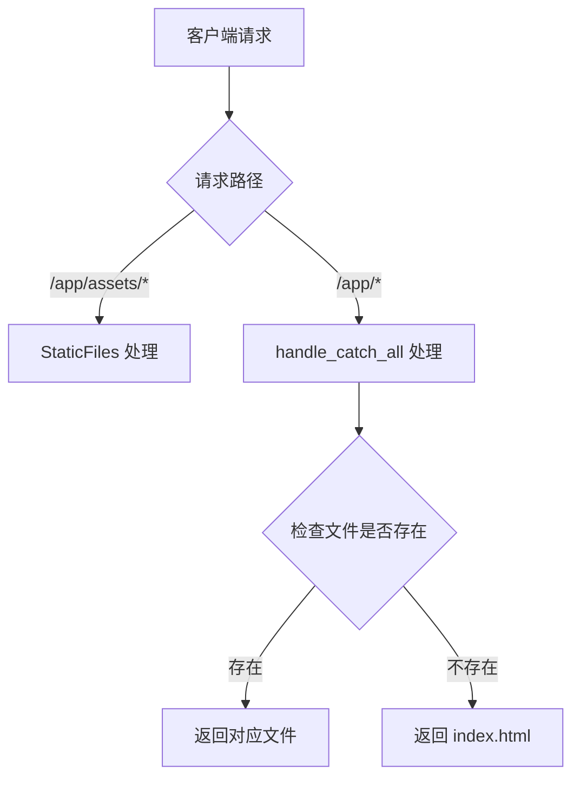
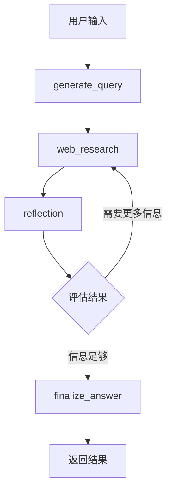

# 系统架构

这是一个基于 LangGraph 和 FastAPI 的全栈应用，主要包含两个部分：

- 前端：React 应用（通过 Vite 构建）
- 后端：FastAPI + LangGraph 应用

# 启动流程

## `langgraph.json` 配置

```json
{
  "dependencies": ["."],
  "graphs": {
    "agent": "./src/agent/graph.py:graph"
  },
  "http": {
    "app": "./src/agent/app.py:app"
  },
  "env": ".env"
}
```

这个配置文件中的执行顺序是：

1. **首先加载 `dependencies`**：
   - 加载当前目录（`.`）作为依赖
   - 这确保了所有必要的 Python 包都被正确安装

2. **然后加载 `graphs`**：
   - 加载 `./src/agent/graph.py` 中的 `graph` 对象
   - 这个 graph 对象定义了 LangGraph 的工作流程
   - 它包含了所有的节点和边，定义了 AI 代理的行为

3. **最后加载 `http`**：
   - 加载 `./src/agent/app.py` 中的 `app` 对象
   - 这个 FastAPI 应用实例会处理所有的 HTTP 请求
   - 它会将请求路由到相应的处理程序

4. **环境变量**：
   - `env: ".env"` 指定了环境变量文件
   - 这个文件会在应用启动时被加载
   - 包含了必要的配置信息（如 API 密钥等）

执行顺序的重要性：
1. 依赖必须先加载，确保所有必要的包都可用
2. Graph 需要先初始化，因为它定义了 AI 代理的核心逻辑
3. HTTP 服务器最后启动，因为它需要依赖 graph 的功能

## **启动方式**
根据 `README.md`，有两种启动方式：

a) 开发环境启动：
```bash
make dev
```
这会同时启动前端和后端开发服务器。

b) 分别启动：
- 后端：在 `backend/` 目录下运行 `langgraph dev`
  - 后端 API 将在 `http://127.0.0.1:2024` 运行
- 前端：在 `frontend/` 目录下运行 `npm run dev`
  - 前端将在 `http://localhost:5173` 运行

## **Docker 部署**
在 `Dockerfile` 中，通过环境变量配置了应用入口：

```dockerfile
ENV LANGGRAPH_HTTP='{"app": "/deps/backend/src/agent/app.py:app"}'
ENV LANGSERVE_GRAPHS='{"agent": "/deps/backend/src/agent/graph.py:graph"}'
```

这是一个典型的全栈应用架构，使用 FastAPI 作为后端框架，React 作为前端框架，通过 LangGraph 提供 AI 能力。

# 入口app.py

```python
# mypy: disable - error - code = "no-untyped-def,misc"
import pathlib
from fastapi import FastAPI, Request, Response
from fastapi.staticfiles import StaticFiles
import fastapi.exceptions

# Define the FastAPI app
app = FastAPI()


def create_frontend_router(build_dir="../frontend/dist"):
    """Creates a router to serve the React frontend.

    Args:
        build_dir: Path to the React build directory relative to this file.

    Returns:
        A Starlette application serving the frontend.
    """
    build_path = pathlib.Path(__file__).parent.parent.parent / build_dir
    static_files_path = build_path / "assets"  # Vite uses 'assets' subdir

    if not build_path.is_dir() or not (build_path / "index.html").is_file():
        print(
            f"WARN: Frontend build directory not found or incomplete at {build_path}. Serving frontend will likely fail."
        )
        # Return a dummy router if build isn't ready
        from starlette.routing import Route

        async def dummy_frontend(request):
            return Response(
                "Frontend not built. Run 'npm run build' in the frontend directory.",
                media_type="text/plain",
                status_code=503,
            )

        return Route("/{path:path}", endpoint=dummy_frontend)

    build_dir = pathlib.Path(build_dir)

    react = FastAPI(openapi_url="")
    react.mount(
        "/assets", StaticFiles(directory=static_files_path), name="static_assets"
    )

    @react.get("/{path:path}")
    async def handle_catch_all(request: Request, path: str):
        fp = build_path / path
        if not fp.exists() or not fp.is_file():
            fp = build_path / "index.html"
        return fastapi.responses.FileResponse(fp)

    return react


# Mount the frontend under /app to not conflict with the LangGraph API routes
app.mount(
    "/app",
    create_frontend_router(),
    name="frontend",
)
```

我来为您解释这个 `backend/src/agent/app.py` 文件的代码：

这是一个使用 FastAPI 框架的后端应用程序文件，主要功能是设置和配置前端应用的静态文件服务。

## 执行流程



## `handle_catch_all` 函数的调用时机

1. **路由匹配顺序**：



2. **具体调用时机**：
   - 当用户访问任何以 `/app` 开头的路径时
   - 首先会检查是否是 `/app/assets/*` 路径
     - 如果是，由 `StaticFiles` 中间件处理
     - 如果不是，则进入 `handle_catch_all` 函数

3. **实际请求处理流程**：

- 用户访问 `/app/about`
  - 不是 `/app/assets/*` 路径
  - 进入 `handle_catch_all`
  - 检查 `about` 文件是否存在
  - 不存在，返回 `index.html`

- 用户访问 `/app/assets/main.js`
  - 匹配 `/app/assets/*` 路径
  - 由 `StaticFiles` 直接处理
  - 不会进入 `handle_catch_all`

# 前后端通讯流程

## **前端入口**：

在 `frontend/src/App.tsx` 中，使用了 `useStream` hook 来与后端通信：

```typescript
const thread = useStream<{
    messages: Message[];
    initial_search_query_count: number;
    max_research_loops: number;
    reasoning_model: string;
  }>({
    apiUrl: import.meta.env.DEV
      ? "http://localhost:2024"
      : "http://localhost:8123",
    assistantId: "agent",
    messagesKey: "messages",
    // ...
  });
```

## **用户输入处理**：

当用户在 `WelcomeScreen` 组件中输入问题并提交时：

```typescript
<InputForm
  onSubmit={handleSubmit}
  isLoading={isLoading}
  onCancel={onCancel}
  hasHistory={false}
/>
```

## **后端处理流程**：

当请求到达后端时，会触发 `graph.py` 中定义的 LangGraph 工作流：



## **状态更新和事件处理**：

前端通过 `onUpdateEvent` 回调处理各种事件：

```typescript
onUpdateEvent: (event: any) => {
  if (event.generate_query) {
    // 处理查询生成事件
  } else if (event.web_research) {
    // 处理网络研究事件
  } else if (event.reflection) {
    // 处理反思事件
  } else if (event.finalize_answer) {
    // 处理最终答案事件
  }
}
```

## **数据流**：

- 用户输入 → 前端 `useStream` hook
- → 后端 FastAPI 路由
- → LangGraph graph 执行
- → 各个节点处理（generate_query, web_research, reflection 等）
- → 结果返回前端
- → 前端更新 UI

---

## 流程

### 1. 路由注册和 API 入口机制

- `backend/langgraph.json` 文件中有如下配置：
  ```json
  {
    "graphs": {
      "agent": "./src/agent/graph.py:graph"
    },
    "http": {
      "app": "./src/agent/app.py:app"
    },
    "env": ".env"
  }
  ```
  - `"graphs"` 指定了 `agent` 这个 graph 的 Python 路径和变量名。
  - `"http"` 指定了 FastAPI app 的 Python 路径和变量名。

- 你在开发时，通常是通过 `langgraph dev` 或类似命令启动后端服务（见 README 说明）。

- **LangGraph 框架会自动根据 `langgraph.json` 配置，注册 API 路由**，将 `agent` 这个 graph 以 API 形式暴露出来，无需你手动写 FastAPI 路由。

---

### 2. 前端请求的 API 路径

- 前端 `useStream` 的 `apiUrl` 配置为 `http://localhost:2024`（开发）或 `http://localhost:8123`（生产）。
- 只要后端用 `langgraph dev` 启动，LangGraph 会自动暴露 `/agent` 相关的 API 路由（如 `/agent/stream`、`/agent/invoke` 等）。
- 这些 API 路由由 LangGraph 框架自动生成，**不是你手写的 FastAPI 路由**。

---

### 3. 请求内容和参数

- 前端通过 `useStream` 发送的请求体内容为：
  ```json
  {
    "messages": [...], // 聊天历史
    "initial_search_query_count": 1/3/5,
    "max_research_loops": 1/3/10,
    "reasoning_model": "xxx"
  }
  ```
- 这些参数会被 LangGraph 框架自动解析，作为 `graph` 的初始 state 传入。

---

### 4. graph 执行的后端代码

- 具体的推理流程在 `backend/src/agent/graph.py` 中定义，核心变量为 `graph`。
- 你定义了各个节点（如 `generate_query`、`web_research`、`reflection`、`finalize_answer`），并用 `StateGraph` 组装成完整的推理流程。
- LangGraph 框架会自动调用这些节点函数，完成整个多轮推理和流式输出。

---

### 5. 总结

- **API 路由不是你手写的，而是 LangGraph 框架根据 `langgraph.json` 自动注册的。**
- 前端请求 `/agent` 路由，LangGraph 框架会自动把请求参数传给 `graph`，并流式返回推理结果。
- 你的主要业务逻辑都在 `src/agent/graph.py`，API 注册和参数解析由 LangGraph 自动完成。

---

### 你可以这样理解

- 只要 `langgraph.json` 配置正确，`langgraph dev` 启动后，前端就能直接通过 `/agent` 路由和后端 graph 通信，无需你手写 API 路由。
- 你只需专注于 graph 的节点实现和流程设计，API 层由 LangGraph 框架托管。

---

## 前端到后端的完整流程

### 1. 前端发起请求

前端React应用使用`useStream` hook来连接LangGraph服务器：

当您调用`thread.submit()`时，`useStream`内部会通过LangGraph SDK客户端发送请求到后端。

### 2. SDK客户端处理

`useStream`使用内部的`Client`实例来发送流式请求：

客户端会调用`client.runs.stream()`方法，这会向LangGraph服务器发送HTTP POST请求到`/runs/stream`端点。

### 3. 后端Graph接收和处理

在后端，LangGraph的Pregel执行引擎接收到请求后，会启动流式执行：

后端graph通过`stream()`方法处理输入，支持多种流模式：
- `"values"`: 流式传输每步后的完整状态
- `"updates"`: 流式传输每个节点的更新
- `"messages"`: 流式传输LLM消息token
- `"custom"`: 流式传输自定义数据

### 4. 远程Graph连接

对于部署的LangGraph应用，使用`RemoteGraph`来处理与服务器的通信：

`RemoteGraph.stream()`方法会调用SDK客户端的`runs.stream()`，建立与LangGraph Platform的连接。

### 5. 流式数据传输

后端graph执行过程中，可以通过`StreamWriter`发送自定义数据：

这些数据会实时流式传输回前端的`useStream` hook。

### 数据流总结

```mermaid
graph LR
    A[React useStream] --> B[LangGraph SDK Client]
    B --> C[HTTP POST /runs/stream]
    C --> D[LangGraph Server]
    D --> E[Pregel Engine]
    E --> F[Graph Execution]
    F --> G[Stream Writer]
    G --> H[WebSocket/SSE]
    H --> I[SDK Client]
    I --> J[useStream Hook]
```



整个流程是双向的：前端通过`submit()`发送输入，后端graph通过流模式实时返回执行结果，前端`useStream`自动处理消息聚合和状态更新。

### Notes

这个流程涉及多个层次：React UI层、SDK客户端层、HTTP传输层、以及后端Pregel执行引擎。`useStream`抽象了所有复杂性，为开发者提供了简单的接口来构建实时聊天应用。流式传输支持多种模式，可以根据应用需求选择合适的数据流类型。

## messagesKey

在 `useStream()` React hook 中，`messagesKey` 参数的作用是指定用于存储消息数据的键名。它决定了在状态对象中，消息数据将被存储在哪个字段下。以下是关于 `messagesKey` 的具体作用和使用场景的详细说明：

### 1. **默认值与作用**
- 默认情况下，`messagesKey` 的值为 `"messages"`。这意味着如果没有显式指定 `messagesKey`，`useStream()` hook 会将消息数据存储在状态对象的 `messages` 字段中。
- 例如，当你调用 `thread.submit()` 提交消息时，新接收的消息会自动追加到状态对象的 `messages` 字段中。

### 2. **自定义键名**
- 如果你的应用程序中需要使用不同的键名来存储消息数据，可以通过设置 `messagesKey` 来实现。例如：
  ```typescript
  const thread = useStream<{ customMessages: Message[] }>({
    apiUrl: "http://localhost:2024",
    assistantId: "agent",
    messagesKey: "customMessages", // 自定义键名
  });
  ```
  在这个例子中，消息数据将被存储在状态对象的 `customMessages` 字段中，而不是默认的 `messages` 字段。

### 3. **灵活性与数据结构设计**
- 使用 `messagesKey` 参数可以让你更灵活地设计应用程序的状态结构。例如，你可以在同一个应用程序中同时处理不同类型的消息数据，而不会相互冲突。例如：
  ```typescript
  const thread1 = useStream<{ messages: Message[] }>({
    apiUrl: "http://localhost:2024",
    assistantId: "agent1",
    messagesKey: "messages",
  });
  
  const thread2 = useStream<{ logs: Message[] }>({
    apiUrl: "http://localhost:2024",
    assistantId: "agent2",
    messagesKey: "logs",
  });
  ```
  在这个例子中，`thread1` 使用默认的 `messages` 键名存储消息，而 `thread2` 使用 `logs` 键名存储消息。

### 4. **与 TypeScript 的结合**
- 当使用 TypeScript 时，`messagesKey` 的灵活性可以让你更清晰地定义类型。例如：
  ```typescript
  type State = {
    customMessages: Message[];
    logs: Message[];
  };
  
  const thread = useStream<State>({
    apiUrl: "http://localhost:2024",
    assistantId: "agent",
    messagesKey: "customMessages",
  });
  ```
  在这种情况下，`messagesKey` 的值 `"customMessages"` 与 TypeScript 类型定义中的字段名一致，从而确保类型安全。

### 5. **总结**
`messagesKey` 参数的主要作用是提供一种灵活的方式来指定消息数据在状态对象中的存储位置。它允许开发者根据应用程序的具体需求自定义键名，从而更好地组织和管理状态数据。

# 后端 LangGraph 工作流程

## 节点

LangGraph 部分实现了一个智能研究助手，主要包含以下节点：

1. **查询生成节点** (`generate_query`)：
   - 使用 Gemini 2.0 Flash 模型
   - 根据用户问题生成优化的搜索查询
2. **网络研究节点** (`web_research`)：
   - 使用 Google Search API 进行网络搜索
   - 收集和整理搜索结果
   - 添加引用标记
3. **反思节点** (`reflection`)：
   - 分析当前收集的信息
   - 识别知识缺口
   - 生成后续查询
4. **评估节点** (`evaluate_research`)：
   - 决定是否需要继续研究
   - 控制研究循环次数
5. **最终答案节点** (`finalize_answer`)：
   - 生成最终的研究报告

## 状态管理

系统使用 `state.py` 中定义的状态类来管理整个流程：
- `OverallState`：整体状态
- `QueryGenerationState`：查询生成状态
- `ReflectionState`：反思状态
- `WebSearchState`：网络研究状态


##  LangGraph依赖

- **后端服务器在生产环境中提供优化后的静态前端构建**：在实际的生产部署场景里，后端服务器会把经过优化处理的前端静态资源（如HTML、CSS、JavaScript文件等）提供给用户访问，以确保前端应用能够高效、快速地运行。
- **LangGraph需要一个Redis实例和一个Postgres数据库**：LangGraph这个系统在运行时依赖两个重要的组件，一个是Redis，它是一个高性能的键值存储数据库，通常用于缓存、消息队列等功能；另一个是Postgres，它是一种功能强大的开源对象关系型数据库系统，用于存储各种结构化数据。
- **Redis被用作发布订阅代理，以实现从后台运行中实时流式传输输出**：这里主要强调了Redis在LangGraph系统中的作用。它通过发布订阅模式，使得后台运行的任务能够将产生的实时数据以流的形式发送出去，从而让前端或其他需要这些数据的部分能够及时获取到最新的信息，实现数据的实时交互。
- **Postgres用于存储助手、线程、运行记录、持久化线程状态和长期记忆，并以"恰好一次"的语义管理后台任务队列的状态**：Postgres在LangGraph系统中承担了多种数据存储和管理的功能。它存储了助手的相关信息、线程（可能是指程序中的线程或者某种业务逻辑中的线程概念）的数据、运行记录等。同时，它还负责持久化线程的状态，即使系统出现故障，线程的状态也不会丢失，能够恢复到之前的状态继续运行。此外，它还存储了长期记忆，可能是系统中一些需要长期保存的数据。在管理后台任务队列方面，它采用了"恰好一次"的语义，这意味着每个任务在队列中只会被处理一次，不会出现重复处理或者遗漏的情况，保证了任务处理的准确性和可靠性。

# OpenAPI简介

**OpenAPI是什么：**

OpenAPI规范（OAS）是一个标准化的、与编程语言无关的HTTP API接口描述规范，它允许人类和计算机在无需访问源代码、额外文档或检查网络流量的情况下，发现和理解服务的功能。

**核心作用：**

1. **标准化API描述**：提供统一的方式来描述HTTP API的结构和功能，消除调用服务时的猜测。

2. **多用途文档**：机器可读的API定义文档可用于交互式文档生成、客户端和服务端代码生成、测试用例自动化等多种用途。

3. **促进API生态系统**：OpenAPI描述可以被文档生成工具、代码生成工具、测试工具等多种工具使用，支持多种编程语言的服务器和客户端生成。

4. **简化API集成**：当正确定义后，API消费者可以用最少的实现逻辑理解并与远程服务交互。

## Notes

OpenAPI规范采用YAML或JSON格式，不要求重写现有API，也不强制绑定任何软件到服务。它主要支持REST API，由OpenAPI Initiative（Linux基金会协作项目）维护，是一个社区驱动的开放规范。

# 前端代码

##  `.ts` 和 `.tsx` 文件的区别：

1. **`.ts` 文件**：
- 纯 TypeScript 文件
- 用于编写普通的 TypeScript 代码
- 不包含 JSX/TSX 语法
- 通常用于：
  - 工具函数
  - 类型定义
  - 配置文件
  - 非 UI 相关的逻辑

2. **`.tsx` 文件**：
- TypeScript + JSX 文件
- 用于编写包含 JSX/TSX 语法的 React 组件
- 可以包含 HTML 标签和 React 组件
- 通常用于：
  - React 组件
  - 包含 JSX 语法的文件
  - UI 相关的代码

从项目结构可以看出：

1. **`.tsx` 文件**（包含 JSX 语法）：
- `App.tsx`：主应用组件
- `main.tsx`：应用入口文件
- `components/` 目录下的所有文件：
  - `ActivityTimeline.tsx`
  - `ChatMessagesView.tsx`
  - `InputForm.tsx`
  - `WelcomeScreen.tsx`
  这些文件都包含 React 组件和 JSX 语法

2. **`.ts` 文件**（纯 TypeScript）：
- `vite-env.d.ts`：Vite 环境类型声明
- `lib/utils.ts`：工具函数
这些文件只包含 TypeScript 代码，没有 JSX 语法

使用建议：
1. 如果你的文件需要：
   - 渲染 HTML 标签
   - 使用 React 组件
   - 包含 JSX 语法
   使用 `.tsx` 扩展名

2. 如果你的文件：
   - 只包含纯 TypeScript 代码
   - 没有 JSX 语法
   - 是工具函数或类型定义
   使用 `.ts` 扩展名

这种区分有助于：
1. 代码可读性：一眼就能看出文件是否包含 UI 组件
2. 类型检查：TypeScript 编译器可以正确处理 JSX 语法
3. 工具支持：IDE 和编辑器可以提供更准确的语法高亮和自动完成

## 前端代码的执行流程：

1. **入口文件**：`main.tsx`
```typescript
// 主要功能：初始化 React 应用
createRoot(document.getElementById("root")!).render(
  <StrictMode>
    <BrowserRouter>
      <App />
    </BrowserRouter>
  </StrictMode>
);
```

2. **主应用组件**：`App.tsx`
```typescript
// 关键函数：
- useStream() // 建立与后端的 WebSocket 连接
- handleSubmit() // 处理用户输入提交
- handleCancel() // 处理取消操作
```

3. **欢迎界面**：`WelcomeScreen.tsx`
```typescript
// 关键函数：
- handleSubmit() // 接收用户输入并传递给 App 组件
```

4. **输入表单**：`InputForm.tsx`
```typescript
// 关键函数：
- handleInternalSubmit() // 处理表单提交
- handleInternalKeyDown() // 处理键盘事件
```

执行流程：

1. **初始化阶段**：
   - `main.tsx` 创建 React 根节点
   - 渲染 `App` 组件
   - 初始化 WebSocket 连接（`useStream`）

2. **用户交互阶段**：
   - 用户看到 `WelcomeScreen` 组件
   - 在 `InputForm` 中输入问题
   - 选择 effort 级别（low/medium/high）
   - 选择模型版本

3. **提交处理阶段**：
   - `InputForm.handleInternalSubmit()` 触发
   - 调用 `WelcomeScreen.handleSubmit()`
   - 最终调用 `App.handleSubmit()`
   - 通过 WebSocket 发送请求到后端

4. **响应处理阶段**：
   - `App.tsx` 中的 `onUpdateEvent` 处理各种事件：
     - `generate_query`：生成搜索查询
     - `web_research`：网络研究
     - `reflection`：反思结果
     - `finalize_answer`：生成最终答案

5. **UI 更新阶段**：
   - 更新消息列表
   - 更新活动时间线
   - 自动滚动到最新消息

关键文件及其职责：
1. `main.tsx`：应用入口
2. `App.tsx`：主应用逻辑和状态管理
3. `WelcomeScreen.tsx`：欢迎界面
4. `InputForm.tsx`：用户输入处理
5. `ChatMessagesView.tsx`：消息显示
6. `ActivityTimeline.tsx`：活动时间线显示

这个架构遵循了 React 的单向数据流原则，从用户输入到后端通信，再到 UI 更新，形成了一个完整的循环。 